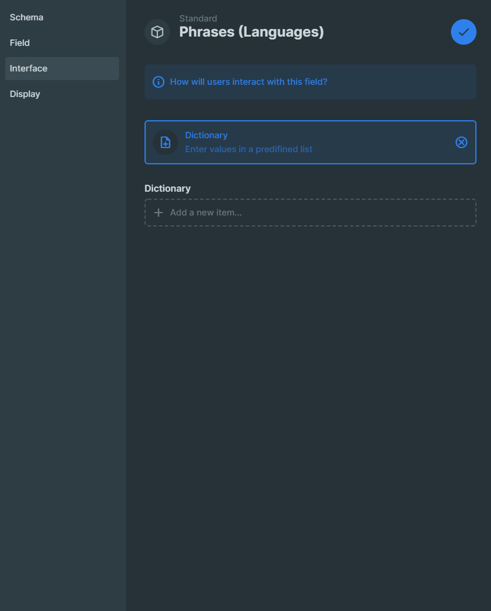
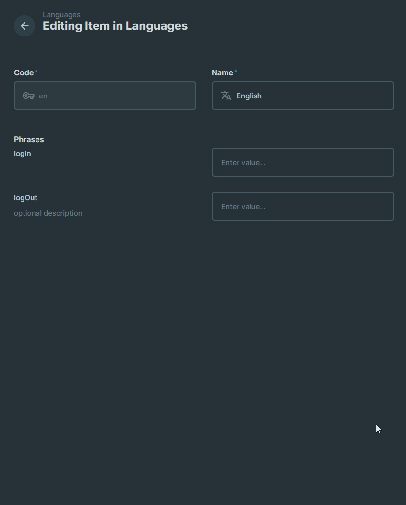

# Directus Dictionary

An extension providing dictionary interface for [Directus](https://github.com/directus/directus) that returns a standartd array of key/value pairs.

## Example setup

Extending the Directus built in repeater interface, you can add, rearange, and delete entries.



The value of this field will be:
```json
[
  { "logIn": "Log In" },
  { "logOut": "Log Out" }
]
```



## Feature List
- [x] Directus interface extension
  - [x] Adding/removing/rearranging keys
  - [x] Adding/removing values
  - [x] Filters out empty values
  - [x] Shows warning in empty fields
  - [ ] Shows completion progress in editor
- [ ] Directus display extension
  - [ ] Displays completion progress in collection view
  - [ ] Sorts items by completion

## Usage

1. Build it via `npm run build`
1. Copy `dist/interfaces/dictionary` to `/directus/extensions/interfaces` (or whereever your extension folder is)
1. Add a new json field to your collection and select the `Dictionary` interface
1. Define keys and add optional descriptions